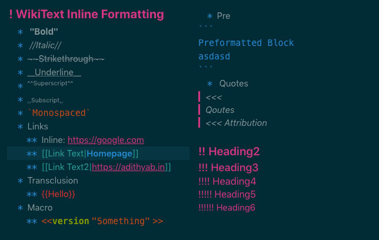

# TW5-codemirror-plus
Towards making a better editor for Tiddlywiki5.
**Demo**: Visit http://adithyab.tiddlyspot.com/ and edit any tiddler to see the new editor.

## To Install
* Make sure Codemirror plugin is installed
  * If not, install codemirror from https://tiddlywiki.com/plugins/tiddlywiki/codemirror/
* Visit http://adithyab.tiddlyspot.com/ and import:
  * $:/plugins/tiddlywiki/codemirror/mode/tw5/tw5.js
  * $:/plugins/tiddlywiki/codemirror/mode/tw5/tw5.css
* Reload
* Go to Settings -> CodeMirror -> Set a Theme
  * Set the theme for codemirror to cmplus

## Current Status

## Roadmap
- [X] Convert the x-tiddlywiki mode by PMario into tw5
- [X] Inline formatting
- [ ] Clickable urls
- [ ] Formatting/autocompletion for Macros
- [ ] List continuation (when typing in a list, pressing enter should add the '\*'s at the beginning

### Some extras to be considered:
- Formatting of Inline Html
- Focus Mode
